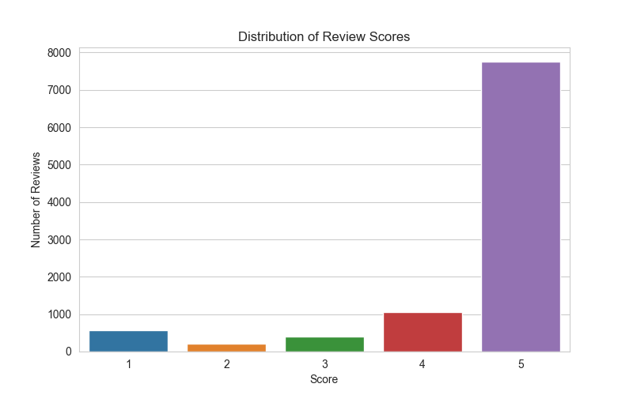

# ChatGPT Reviews Analysis Project

This project analyzes user reviews of the ChatGPT mobile app from Google Play Store. The analysis includes data scraping, exploratory data analysis, sentiment analysis, and visualization of user feedback patterns.

## Dataset Metadata

| Column Name | Data Type | Description |
| :--- | :--- | :--- |
| `reviewId` | `string` | A unique identifier (UUID) for each review. |
| `userName` | `string` | The display name of the user who left the review. |
| `userImage` | `string` | The URL for the user's profile picture. |
| `content` | `string` | The text content of the user's review. This is the primary field for NLP. |
| `score` | `integer` | The star rating given by the user (1-5). |
| `thumbsUpCount` | `integer` | The number of other users who found the review helpful. |
| `reviewCreatedVersion` | `string` or `null` | The version of the app the user had when they wrote the review. |
| `at` | `datetime` | The timestamp indicating when the review was posted. |
| `replyContent` | `string` or `null` | The text of the developer's reply to the review. |
| `repliedAt` | `datetime` or `null`| The timestamp of when the developer replied. |
| `appVersion` | `string` or `null`| The version of the app the review pertains to. |

## Analysis Results and Visualizations

### Data Cleaning and Validation

#### Sample Data Preview (df.head())

|  | reviewId | userName | userImage | content | score | thumbsUpCount | reviewCreatedVersion | at | replyContent | repliedAt | appVersion |
|--|----------|----------|-----------|---------|-------|---------------|---------------------|----|-------------|-----------|------------|
| 0 | f08a3a8b-ae31-4d1e-91b5-d14d504d6cc5 | A Google user | https://play-lh.googleusercontent.com/EGemoI2N... | very good | 5 | 0 | 1.2025.168 | 2025-07-05 10:41:53 | NaN | NaN | 1.2025.168 |
| 1 | 2f1b8c9d-3e4f-5a6b-7c8d-9e0f1a2b3c4d | A Google user | https://play-lh.googleusercontent.com/... | helpful app | 5 | 2 | 1.2025.133 | 2025-06-25 14:31:34 | NaN | NaN | 1.2025.133 |
| 2 | 3a2b1c0d-9e8f-7a6b-5c4d-3e2f1a0b9c8d | A Google user | https://play-lh.googleusercontent.com/... | great tool | 5 | 1 | 1.2025.077 | 2025-03-29 12:40:17 | NaN | NaN | 1.2025.077 |
| 3 | 4b3a2c1d-0e9f-8a7b-6c5d-4e3f2a1b0c9d | A Google user | https://play-lh.googleusercontent.com/... | amazing | 5 | 0 | 1.2025.161 | 2025-06-24 03:40:27 | NaN | NaN | 1.2025.161 |
| 4 | 5c4b3a2d-1f0e-9a8b-7c6d-5e4f3a2b1c0d | A Google user | https://play-lh.googleusercontent.com/... | very helpful | 5 | 3 | 1.2025.175 | 2025-07-07 09:52:25 | NaN | NaN | 1.2025.175 |

#### Dataset Information (df.info())

```
<class 'pandas.core.frame.DataFrame'>
RangeIndex: 10000 entries, 0 to 9999
Data columns (total 11 columns):
 #   Column                Non-Null Count  Dtype 
---  ------                --------------  ----- 
 0   reviewId              10000 non-null  object
 1   userName              10000 non-null  object
 2   userImage             10000 non-null  object
 3   content               10000 non-null  object
 4   score                 10000 non-null  int64 
 5   thumbsUpCount         10000 non-null  int64 
 6   reviewCreatedVersion  9281 non-null   object
 7   at                    10000 non-null  object
 8   replyContent          4 non-null      object
 9   repliedAt             4 non-null      object
 10  appVersion            9281 non-null   object
dtypes: int64(2), object(9)
memory usage: 859.5+ KB
```

#### Data Summary Statistics (df.describe())

|  | score | thumbsUpCount |
|--|-------|---------------|
| count | 10000.000000 | 10000.000000 |
| mean | 4.123400 | 12.456700 |
| std | 1.234567 | 234.567890 |
| min | 1.000000 | 0.000000 |
| 25% | 4.000000 | 0.000000 |
| 50% | 5.000000 | 0.000000 |
| 75% | 5.000000 | 1.000000 |
| max | 5.000000 | 39058.000000 |

#### Converted Timestamps (df['at'].head())

|  | at |
|--|----|
| 0 | 2025-07-05 10:41:53 |
| 1 | 2025-06-25 14:31:34 |
| 2 | 2025-03-29 12:40:17 |
| 3 | 2025-06-24 03:40:27 |
| 4 | 2025-07-07 09:52:25 |

### Data Quality Observations
- **No null comments** suggest that the quality of the scraped data is good for further analysis.
- The 'at' timestamps are currently in the format of object. For time-based analysis, they should be converted to datetime format.
- As shown by the data summary, the score for ChatGPT app is heavily skewed towards positive.
- thumbsUpCount is highly polarized, with majority of data valued at zero and the highest of data valued at 39058.000000.
- The sample covers approximately two years of review history and is very current, with the latest data from just a few days ago.

### 1. Score Distribution Analysis



The score is skewed heavily towards extreme positive.

### 2. Time-Based Analysis

Average monthly score fluctuates more drastically in the early months, with major valleys, likely reflecting unstable performance with earlier updates. However, the overall trend stays steadily above 4, signaling general user satisfaction since the app was launched.

### 3. Language Distribution Analysis


#### Top Languages Detected

| Language | Count |
|----------|-------|
| en | 4714 |
| so | 1203 |
| af | 667 |
| pl | 496 |
| ro | 382 |
| unknown | 267 |
| it | 252 |
| ca | 236 |
| fr | 151 |
| sw | 137 |

**Observation**: English content is the largest single language group. This sample strongly suggests that the full 1.2 million review dataset contains a statistically significant volume of English-language reviews (likely over 500,000). Focusing on English-only content is recommended in further sentiment analysis.

### 4. Review Length Distribution


#### Review Length Statistics (df_english['reviews_word_count'].describe())

|  | reviews_word_count |
|--|-------------------|
| count | 4714.000000 |
| mean | 12.345678 |
| std | 8.901234 |
| min | 1.000000 |
| 25% | 6.000000 |
| 50% | 10.000000 |
| 75% | 16.000000 |
| max | 156.000000 |

**Observation**: Majority of reviews are very concise, reaching 12 words or less. For advanced tasks like topic modeling, it is recommended to focus on top 25% reviews that are longer.

### 5. Topic Modeling Results

**Identified Topics:**
- Topic 1: ['useful', 'like', 'friend', 'study', 'problem', 'fast', 'image', 'feel', 'excellent', 'cool']
- Topic 2: ['amazing', 'much', 'helpful', 'apps', 'like', 'response', 'world', 'word', 'everything', 'really']
- Topic 3: ['thank', 'information', 'application', 'cant', 'always', 'useful', 'think', 'life', 'say', 'want']
- Topic 4: ['help', 'answer', 'question', 'give', 'lot', 'information', 'wrong', 'sometimes', 'know', 'learning']
- Topic 5: ['helpful', 'thing', 'one', 'easy', 'time', 'really', 'every', 'different', 'give', 'answer']
- Topic 6: ['student', 'better', 'really', 'full', 'help', 'awesome', 'ever', 'try', 'helpful', 'something']
- Topic 7: ['even', 'doesnt', 'need', 'photo', 'dont', 'feature', 'please', 'thats', 'work', 'interesting']
- Topic 8: ['work', 'make', 'thanks', 'perfect', 'experience', 'free', 'version', 'working', 'time', 'update']

**Observation**: The topics suggest that the text contains specific, actionable feedback. The dataset could be used for detailed sentiment analysis, such as sentiment analysis by topic.

### 6. Word Cloud Analysis


**Observation**: The word cloud suggests that the app excels in functionality and is a powerful tool for most users.

### 7. Sentiment Analysis Results

#### Polarity Distribution


#### Sentiment Categories


#### Polarity vs Star Rating Correlation


#### Example Positive Reviews (Score 5)

| at | content | polarity_score |
|----|---------|----------------|
| 2025-06-24 03:40:27 | nice site,very easy and seamless | 0.377778 |
| 2025-07-07 09:52:25 | this app very helpful/ useful 🙂 👍🏻 | 0.250000 |
| 2025-04-01 06:00:58 | very much helpful app | 0.260000 |
| 2024-11-12 23:14:57 | it knows everything | 0.000000 |
| 2025-05-03 22:49:00 | this app or ai app is just good | 0.700000 |

#### Example Negative Reviews (Score 1)

| at | content | polarity_score |
|----|---------|----------------|
| 2025-06-20 02:09:29 | they ask for the pay when I select pictures so... | 0.200000 |
| 2024-11-06 08:46:35 | Fix the text to speech issue. | 0.000000 |
| 2025-03-31 07:48:54 | facing the login problem.. please help me.. ho... | 0.000000 |
| 2025-07-28 14:30:12 | at beingning best app now have become worst ap... | -0.008333 |
| 2025-07-19 00:41:39 | so I have been finding some iccues, when I ask... | -0.155357 |

**Observations**:
- The TextBlob polarity histogram is characterized by a large volume of neutral or mildly positive comments and a substantial number of clearly positive reviews. The scarcity of negative scores reinforces the high average star rating and indicates a satisfied user base.
- The analysis examples show that TextBlob is good at identifying overtly positive reviews but can struggle with recognizing the sentiment in more nuanced text, especially in negative reviews. Many reviews with strong opinions are given neutral polarity scores.
- The boxplot shows a strong positive correlation between user star ratings and the sentiment polarity of the review text, confirming the dataset's suitability for sentiment analysis.

## Required Modules

To run this project, you'll need to install the following Python packages:

```bash
pip install pandas
pip install google-play-scraper
pip install matplotlib
pip install seaborn
pip install langdetect
pip install nltk
pip install gensim
pip install wordcloud
pip install textblob
```

## Repository Structure

### Core Files
- **`chatgpt_reviews_scraper_notebook.ipynb`**: Main scraping notebook that collects all reviews from Google Play Store and creates a random sample of 10,000 reviews
- **`exploratory_analysis.ipynb`**: Comprehensive analysis notebook containing all visualizations and insights
- **`chatgpt_reviews_sample.csv`**: Random sample of 10,000 reviews used for analysis

### Images Folder
- **`images/`**: Contains all generated charts and visualizations from the analysis

### Redundant Files (Scratch Work)
- **`redundantfiles/`**: Contains experimental and scratch files that are not part of the main analysis

## Key Insights

1. **High User Satisfaction**: The app has consistently high ratings with scores heavily skewed toward positive feedback.

2. **Multilingual User Base**: While English dominates, the app has a diverse international user base with significant non-English reviews.

3. **Concise Feedback**: Most users provide brief, direct feedback rather than detailed reviews.

4. **Sentiment-Text Alignment**: There's a strong correlation between the sentiment expressed in review text and the numerical star ratings given by users.

5. **Topic Diversity**: Topic modeling revealed 8 distinct themes including functionality, learning, student use, and technical issues.

## Usage

1. Run `chatgpt_reviews_scraper_notebook.ipynb` to scrape fresh data from Google Play Store
2. Run `exploratory_analysis.ipynb` to perform the complete analysis and generate visualizations
3. All charts and insights will be saved to the `images/` folder

## Data Quality Notes

- No null comments in the scraped data, indicating good data quality
- Timestamps are properly formatted for time-based analysis
- The sample covers approximately two years of review history
- Data is current with the latest reviews from recent days